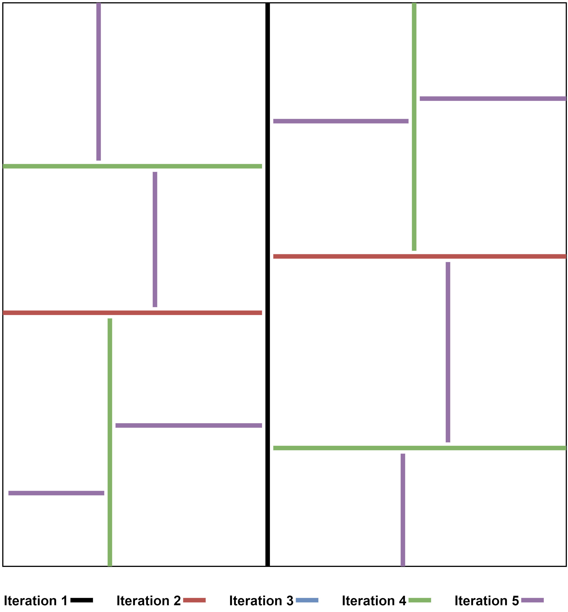

# Minecraft-like Procedural Generation

## Introduction
### Context
I'm currently a student at the SAE Institute of Geneva in the Games Programming section. For the current module of Computer Graphics, we had to create a Minecraft-like game with our own custom Graphics Engine. My task in this project was to create the procedural generation of the game 
### Constraints
I had a lot of different constraints when creating the map:
* No water
* Map composed of blocks
* Return a 3d array of ints

The map couldn't have any water because it was too complicated for the Engine team to render the water.
I had to return a 3d array of ints, because they represent the blocks ids for our map.


## Biomes

### Shape

#### Voronoi Diagram


My first idea was to implement a Voronoi Diagram algorithm. My idea was to generate random dots on the entire map to generate every zone, and then to link every dot with their neighbors to get every zone neighbors. Each zones needed to know the neighbors so it will be simpler later to generate each kind of biomes.

The problem was that I couldn't link the biomes dots with their neighbors and I couldn't easily find the zones neighbors blocks to then lerp them with their neighbors. So I decided to abort this technique.
#### Binary Space Partitioning Without Rectangles
I then decided to work with binary space partitioning with convex shapes. 

I decided first to create a **struct Zone**:

```Cpp
struct Zone
{
    Zone(Vector2Int[] b1, Vector2Int[] b2, Vector2Int[] b3, Vector2Int[] b4)
        {
            border1 = b1;
            border2 = b2;
            border3 = b3;
            border4 = b4;
        }
        public Vector2Int[] border1;
        public Vector2Int[] border2;
        public Vector2Int[] border3;
        public Vector2Int[] border4;

}
```
Then I decided to create a function GenerateZones that takes as an argument

Here are the zones creation steps:

* Step 1: Chose two random points of the edges borders to cut
* Step 2: Create children zones
* Step 3: Generate the uncut borders for each children zone
* Step 4: Calculate the unknown borders of each children zone
* Step 5: Use the GenerateZone function for each children zone

I decided to abord this technique because I still couldn't find the zones neighbors and I couldn't find an efficient way to calculate the map after that and I had no more time to answer to these questions.
#### Binary Space Partitionning With Rectangles
I decided finally to implement a binary space partitioning algorithm with rectangles.

I created zones structures containing their biome and terrain, their neighbors and the blocks they contains and then I decided to cut each zones like you can see on the picture below:


With the algorithm I used, I was able to have a map with a lot of different zones that will be useful to spawn the different kind of biomes and terrain.

### Terrain and Biomes
Having a lot of different zones, I decided to implement 3 types of terrains:

* Mountains
* Hills
* Plains

I also decided to implement 3 types of biomes:

* Snow
* Desert
* Green

This is how I decided to implement the different kind of terrains and biomes:


## Perlin Noise
To generate my biomes I've used Perlin Noise. 
### Linking Biomes together
To link the biomes together I've lerped every blocks around the zone borders.
